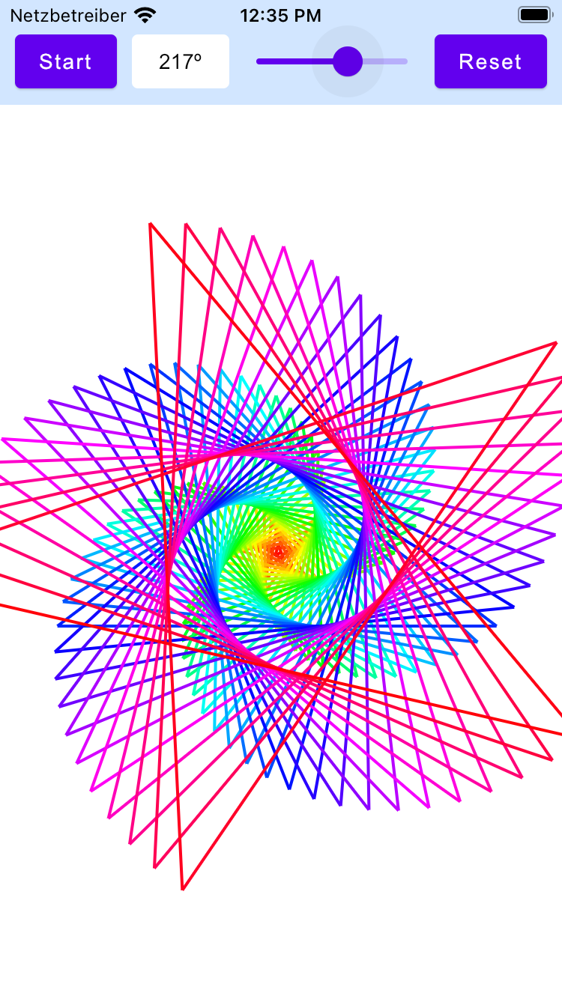

# PolySpiralMpp Demo

The image shows the PolySpiralMpp demo running on the iOS simulator.

## Run on JVM
`./gradlew run`

## Run native on MacOS
  `./gradlew runDebugExecutableMacosX64` (Works on Intel processors)

## Run web assembly in browser
  `./gradlew jsBrowserDevelopmentRun`

## Run on iOS simulator
  `./gradlew iosDeployIPhone8Debug`
  `./gradlew iosDeployIPadDebug`

## Run on iOS device

See: https://github.com/JetBrains/compose-jb/tree/master/experimental/examples/falling-balls-mpp
